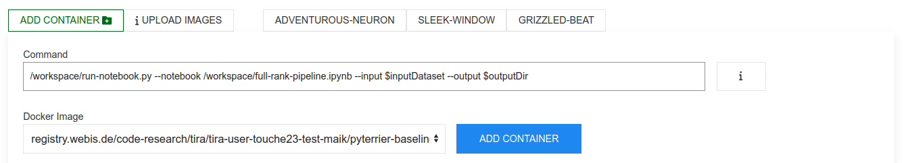

# PyTerrier Starter and Baseline for Task 2 on "Evidence Retrieval for Causal Questions"

This is the [PyTerrier](https://github.com/terrier-org/pyterrier) baseline for [task 2 on Evidence Retrieval for Causal Questions](https://touche.webis.de/clef23/touche23-web/evidence-retrieval-for-causal-questions.html) in [Touché 2023](https://touche.webis.de/clef23/touche23-web/).

There are two baselines, one full rank retrieval baseline (in [full-rank-pipeline.ipynb](full-rank-pipeline.ipynb)) that uses ChatNoir and one re-ranking baseline that re-ranks the results of some first-stage ranker (in [re-rank-pipeline.ipynb](re-rank-pipeline.ipynb)).

In TIRA, you submit working software in Docker images, and the [Dockerfile](Dockerfile) embedds both scripts in a container (starting from a generic [TIRA ChatNoir starter](https://github.com/tira-io/ir-experiment-platform/tree/main/tira-ir-starters/chatnoir)) that has a script [run-notebook.py](https://github.com/tira-io/ir-experiment-platform/blob/main/tira-ir-starters/pyterrier/run-pyterrier-notebook.py) that allows you to run a PyTerrier retrieval pipeline implemented in a Jupyter Notebook in TIRA.

## Prerequisities:

Please [install docker](https://docs.docker.com/get-docker/) and `tira` (via `pip3 install tira`) on your machine.

## Run a Jupyter Notebook locally for Development

You can run a Jupyter Notebook in the [TIRA ChatNoir starter](https://github.com/tira-io/ir-experiment-platform/tree/main/tira-ir-starters/chatnoir) without adoption for local development. Please execute the following command (assuming you have cloned this repository and your current directory is the directory that contains this `README.md`):

```
docker run --rm -ti \
    -p 8888:8888 \
    -v ${PWD}:/workspace \
    webis/tira-touche23-task-2-pyterrier-baseline:0.0.2 \
    jupyter-lab --allow-root --ip 0.0.0.0
```

You can adapt/run the baseline notebooks locally with docker and can directly deploy and run it in [TIRA.io](https://www.tira.io/task/touche-2023-task-2).

You can build this image on your machine with this command:

```
docker build -t webis/tira-touche23-task-2-pyterrier-baseline:0.0.2 .
```


## Full Rank Starter with ChatNoir

The notebook [full-rank-pipeline.ipynb](full-rank-pipeline.ipynb) implements "full-rank" retrieval with ChatNoir so that the results retrieved by ChatNoir can be easily re-ranked.

To deploy approaches in TIRA, you upload the image and specify the command that is to be executed in the image. TIRA gives you a personalized documentation on how to upload the image, and to run this notebook in TIRA you can specify the following command in TIRA:
To test your pipeline locally, you can run the script [run-notebook.py](run-notebook.py) as `local-dry-run`, e.g., by:

```
/workspace/run-pyterrier-notebook.py --notebook /workspace/full-rank-pipeline.ipynb --input $inputDataset --output $outputDir
```

You can dry-run this on your machine by executing the command:

```
tira-run \
    --input-directory ${PWD}/sample-input/full-rank \
    --image webis/tira-touche23-task-2-pyterrier-baseline:0.0.2 \
    --command '/workspace/run-pyterrier-notebook.py --notebook /workspace/full-rank-pipeline.ipynb --input $inputDataset --output $outputDir'
```

In this example above, the command `/workspace/run-pyterrier-notebook.py --notebook /workspace/full-rank-pipeline.ipynb --input $inputDataset --output $outputDir` is the command that you would enter in TIRA, and the `--input-directory` flag points to the inputs.

This creates a run file `tira-output/run.txt`, with content like (`cat sample-output/run.txt |head -3`):

```
1 NEU clueweb12-1106wb-16-17437 1 1182.2903 chatnoir-baseline
1 NEU clueweb12-0302wb-19-28258 2 1168.2012 chatnoir-baseline
1 NEU clueweb12-1212wb-00-02238 3 1167.9583 chatnoir-baseline
```

### Deploy and Run the Full Rank Starter in TIRA

First, you have to upload the image to TIRA.
TIRA gives you personalized credentials to upload your image:


For instance, to upload this baseline, you may tag the image accordingly and then push the image to your personal/private registry in TIRA, i.e., run the following commands (replace `<YOUR-TEAM-NAME>` with the name of your team as indicated by the personalized documentation in TIRA):

```
docker tag webis/tira-touche23-task-2-pyterrier-baseline:0.0.2 registry.webis.de/code-research/tira/tira-user-<YOUR_TEAM_NAME>/pyterrier-baseline:0.0.1
docker push registry.webis.de/code-research/tira/tira-user-<YOUR_TEAM_NAME>/pyterrier-baseline:0.0.1
```

With the image uploaded, you can add the TIRA software by specifying the following command in TIRA:

```
/workspace/run-notebook.py --notebook /workspace/full-rank-pipeline.ipynb --input $inputDataset --output $outputDir
```

The resulting software configuration in TIRA might look like this:




## Re-Rank Starter/Baseline


The notebook [re-rank-pipeline.ipynb](re-rank-pipeline.ipynb) implements a re-ranking baseline that re-ranks the results of some first-stage ranker.

To deploy approaches in TIRA, you upload the image and specify the command that is to be executed in the image. TIRA gives you a personalized documentation on how to upload the image, and to run this notebook in TIRA you can specify the following command in TIRA:

```
/workspace/run-pyterrier-notebook.py --notebook /workspace/re-rank-pipeline.ipynb --input $inputDataset --output $outputDir
```

You can dry-run this on your machine by executing the command:

```
tira-run \
    --input-directory ${PWD}/sample-input/re-rank \
    --image webis/tira-touche23-task-2-pyterrier-baseline:0.0.2 \
    --command '/workspace/run-pyterrier-notebook.py --notebook /workspace/re-rank-pipeline.ipynb --input $inputDataset --output $outputDir'
```

In this example above, the command `/workspace/run-pyterrier-notebook.py --notebook /workspace/re-rank-pipeline.ipynb --input $inputDataset --output $outputDir` is the command that you would enter in TIRA, and the `--input-directory` flag points to the inputs.

This creates a run file `tira-output/run.txt`, with content like (`cat sample-output/run.txt |head -3`):

```
1111 NEU clueweb12-1106wb-16-17437 1 -1.6923219067023894 bm25-re-rank-baseline
1111 NEU clueweb12-1212wb-00-02238 2 -2.768819661029173 bm25-re-rank-baseline
1111 NEU clueweb12-0302wb-19-28258 3 -2.768819661029173 bm25-re-rank-baseline
```

# Additional Resources

- The [PyTerrier tutorial](https://github.com/terrier-org/ecir2021tutorial)
- The [PyTerrier documentation](https://pyterrier.readthedocs.io/en/latest/)
- The [TIRA quickstart](https://touche.webis.de/clef23/touche23-web/evidence-retrieval-for-causal-questions.html#tira-quickstart)


# Publishing this image

We publish this image via the following command:

```
docker push webis/tira-touche23-task-2-pyterrier-baseline:0.0.1
```

